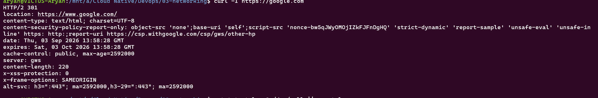
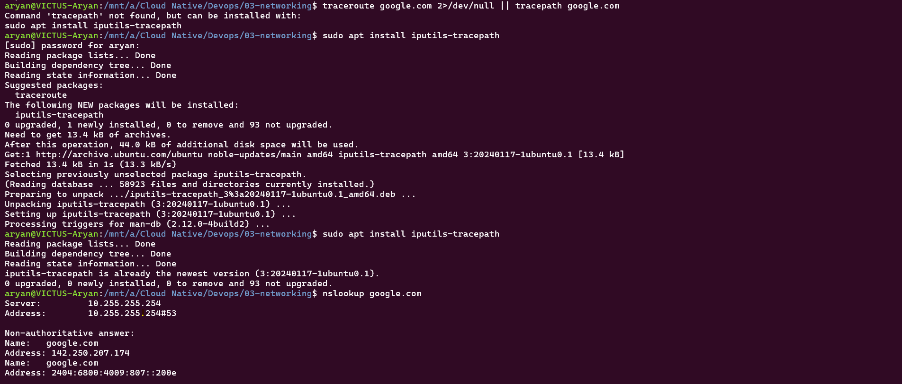

# Networking Fundamentals

## ip a
Shows all network interfaces on the system and their assigned IP addresses.

## ip route
Displays the system's routing table — which gateway traffic uses to reach different networks.

## ping -c 4 google.com
Tests connectivity to a host by sending 4 ICMP echo packets and measuring response time.

## curl -I https://google.com
Fetches only the HTTP response headers from a URL, useful for checking if a server is up without downloading the page.

## traceroute google.com
Shows the path (hop by hop) packets take to reach a destination, useful for diagnosing where a connection is slow or failing.

## nslookup google.com
Queries DNS servers to resolve a domain name to its IP address.

## hostname -I
Displays the IP address(es) assigned to this machine.

