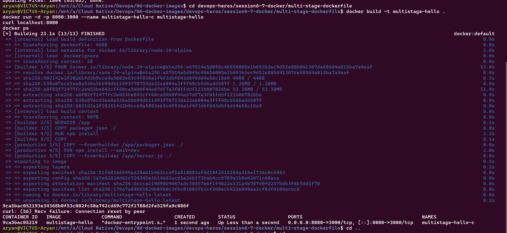

## Task 2: Docker Multi-Stage Build

**Name:** Aryan Bhendarkar  
**Enrollment Number:** 24BCS10292

## Application Output

## docker ps output
CONTAINER ID   IMAGE              COMMAND                  CREATED        STATUS                  PORTS                                         NAMES
9ca5bac05219   multistage-hello   "docker-entrypoint.s…"   1 second ago   Up Less than a second   0.0.0.0:8080->3000/tcp, [::]:8080->3000/tcp   multistage-hello-c

## Task 3: Multiple Application Types Deployed
Already demonstrated in `05-docker-fundamentals/` — Node.js, Python, and Java Hello World
apps were each containerized and run successfully (see that folder's README for output).
EOF